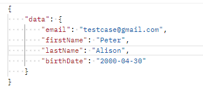
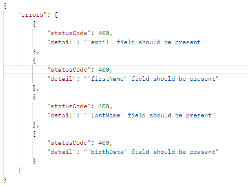

# RESTful application dedicated to manipulations with Users entity

Application supports GET, POST, PATCH, PUT and DELETE REQUESTS.
 ___

Basic application url is:

        http://localhost:8080/v1/users

* GET --> returns all users whose birthday is in the provided date interval.
  Requires two parameters: startDate, endDate.
* POST --> creates a new user.
  Users under 18 could not be registered (value could be changed in the property file).
* PATCH --> updates one/some user fields.
  In case all data fields are provided, exception will be thrown.
  URL example: `.../v1/users/1`, where 1 - user identifier.
* PUT --> updates all user fields.
  If all fields are not present an exception will be thrown.
  URL example: `.../v1/users/1`, where 1 - user identifier.
* DELETE --> deletes user from application.
  URL example: `.../v1/users/1`, where 1 - user identifier.
___ 

All well-worked and error responses are wrapped in extra fields.
* Worked-well response example:
  
* Error response example:
  

___

Additionally, all data in request bodies should be also wrapped in a `data` field.